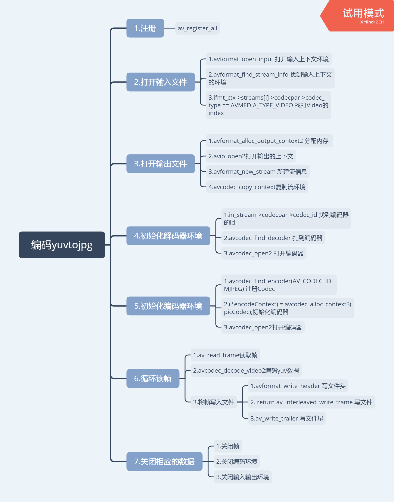

# ffmpegPro

---

## 1. [master](https://github.com/weisheng2669/ffmpegPro)分支

---

## 2. [decodeAndencode](https://github.com/weisheng2669/ffmpegPro/tree/decodeAndencode)分支

+ yuv编码为jpg

  

---

## 3. [video_operation](https://github.com/weisheng2669/ffmpegPro/tree/video_operation)分支

+ 实时流中获取实时图片

----

## 4. [operations](https://github.com/weisheng2669/ffmpegPro/tree/operations)分支

+ 封装
+ 转封装
+ 解封装